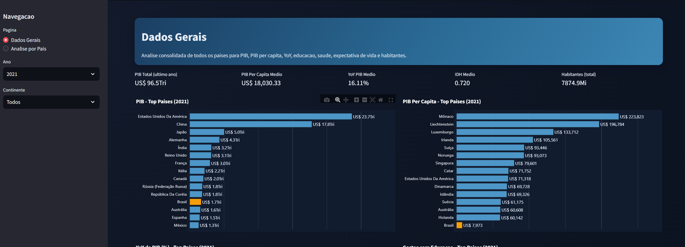
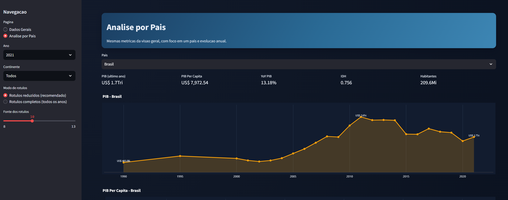

# IBGE Analytics - PIB e Indicadores por Paises

Pipeline de dados com API publica do IBGE, ingestao em PostgreSQL e transformacoes com dbt, com portal interativo em Streamlit.

## Escopo Atual

O projeto usa o domínio de países da API do IBGE e coleta:

- `77827` Economia - Total do PIB
- `77831` Indicadores sociais - Índice de desenvolvimento humano
- `77819` Economia - Gastos públicos com educação
- `77820` Economia - Gastos públicos com saúde
- `77823` Economia - PIB per capita
- `77830` Indicadores sociais - Esperança de vida ao nascer
- `77849` População - População
- IPCA mensal nacional via API v3 agregados

## Estrutura

```text
ibge-pib-analytics/
 docker-compose.yml
 Makefile
 requirements.txt
 src/
    ibge_api_client.py
    data_loader.py
 dbt/
    dbt_project.yml
    profiles.yml
   data/
      country_continent_depara.csv
    models/
        staging/
           _stg_sources.yml
        marts/
         dim_pais.sql
         dim_indicador.sql
         fato_indicador.sql
         _marts_dim_fact.yml
 sql/
     analytics_queries.sql
```

## Como Executar (Windows PowerShell)

### 1) Clonar o repositorio

```powershell
git clone git@github.com:maurischulz/ibge-pib-analytics.git
Set-Location .\ibge-pib-analytics
```

### 2) Ambiente Python

```powershell
py -3.11 -m venv .venv
.\.venv\Scripts\Activate.ps1
python -m pip install --upgrade pip
python -m pip install -r requirements.txt
```

### 3) Variaveis de ambiente

```powershell
Copy-Item .env.example .env
```

### 4) Banco local

```powershell
docker compose up -d
```

### 5) Extracao + carga raw

```powershell
python src/data_loader.py
```

Isso gera e carrega:

- `raw_ibge.raw_pib_paises`
- `raw_ibge.raw_indicadores_paises`
- `raw_ibge.raw_ipca`

### 6) Transformacoes dbt

```powershell
Set-Location dbt
..\.venv\Scripts\dbt.exe seed --select country_continent_depara --full-refresh
..\.venv\Scripts\dbt.exe run
..\.venv\Scripts\dbt.exe test
Set-Location ..
```

### 7) Executar o portal

```powershell
.\.venv\Scripts\python -m streamlit run web/portal.py
```

### 8) Consultas analiticas

Use o arquivo `sql/analytics_queries.sql` no PostgreSQL.

## Fluxo Rapido (resumo)

```powershell
docker compose up -d
python src/data_loader.py
Set-Location dbt
..\.venv\Scripts\dbt.exe seed --select country_continent_depara --full-refresh
..\.venv\Scripts\dbt.exe run
Set-Location ..
.\.venv\Scripts\python -m streamlit run web/portal.py
```

## Tabelas Marts (Nova Estrutura)

- `analytics_marts.dim_pais` (pais_id, pais, continente)
- `analytics_marts.dim_indicador` (id_indicador, indicador, unidade)
- `analytics_marts.fato_indicador` (pais_id, indicador_id, ano, valor)

## Convenções de Indicadores

- `1` = PIB total (derivado de `raw_ibge.raw_pib_paises`)
- Demais IDs = indicadores vindos de `raw_ibge.raw_indicadores_paises`
- IPCA mensal permanece em `raw_ibge.raw_ipca` para análises temporais

## Portal Web (Portfolio)

O portal esta organizado em 2 paginas principais:

- Dados Gerais:
   - KPIs consolidados no ano selecionado (PIB total, PIB per capita medio, YoY medio, IDH medio, habitantes)
   - Rankings Top Paises por indicador
   - Filtros por Ano e Continente
- Analise por Pais:
   - KPIs do pais selecionado
   - Serie anual para PIB, PIB per capita, YoY, educacao, saude, expectativa de vida, IDH e habitantes
   - Modo de rotulos: reduzidos ou completos
   - Controle de tamanho da fonte dos rotulos

Consultas do portal usam `analytics_marts.dim_pais` e `analytics_marts.fato_indicador`.

## Prints do Portal

Adicione as imagens no repositorio em `docs/screenshots/` e mantenha os nomes abaixo:




## Observações

- A API do IBGE pode oscilar; o coletor possui fallback para dados simulados para permitir validacao end-to-end.
- O projeto foi consolidado para nomenclatura por paises.
